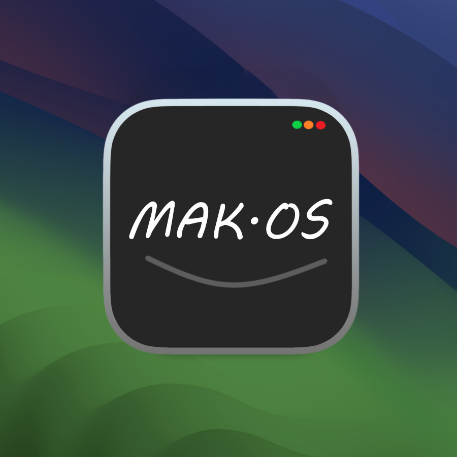

CatOS is now MAK.OS!

<h1>MAK.OS</h1>

<b>MAK.OS</b> is a web-based desktop operating system experience built with HTML, CSS, and JavaScript. It is an experimental project that recreates the look and feel of a modern desktop environment directly inside a web browser.

This project is <b>not a real operating system</b>, but it demonstrates how web technologies can simulate desktop-style computing, including movable windows, a taskbar, desktop icons, applications, and more.

<h2><u>Features</u></h2>

🪟 Fully functional window-grabbing system built with JavaScript.

📌 Taskbar with active window indicators inspired by Windows 11.

🕒 Live clock in the taskbar.

🌐 Two configurable WebViewer apps that can display websites.

🖼️ Multiple wallpapers selectable through the Settings app.

👤 Login screen with logout and sleep functionality.

🙋 Username displayed in the Start Menu.

🌍 Built-in web browser powered by my MAK_Tab project.

🖥️ Desktop icons.

✨ Smooth animations and desktop-like user experience.

<h2><u>Tech Stack</u></h2>

• HTML5

• CSS3

• Vanilla JavaScript (ES6)

All desktop functionality, including the window management system, was built from scratch using JavaScript.

<h2><u>Running Locally</u></h2>

1. Clone the repository:

<pre><code>git clone https://github.com/ak-web-dev/mak.os.git</code></pre>

2. Open the project folder.

3. Launch <code>index.html</code> in your browser, or use a local development server such as VS Code Live Server.

<h2><u>Project Goal</u></h2>

MAK.OS was created as a fun project to explore what can be achieved with modern web technologies. The goal is to recreate the desktop operating system experience entirely inside a web browser while keeping the project lightweight and easy to understand.

<h2><u>Live Demo</u></h2>

🌐 <a href="https://mako-s.netlify.app/">https://mako-s.netlify.app/</a>

<h2><u>Screenshots</u></h2>

<h2><u>Author</u></h2>

Created by <b>AK Dev</b>

Follow the project on <a href="https://stardance.hackclub.com/projects/14824">Stardance!</a>

GitHub: <a href="https://github.com/ak-web-dev">https://github.com/ak-web-dev</a>

